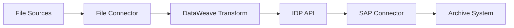
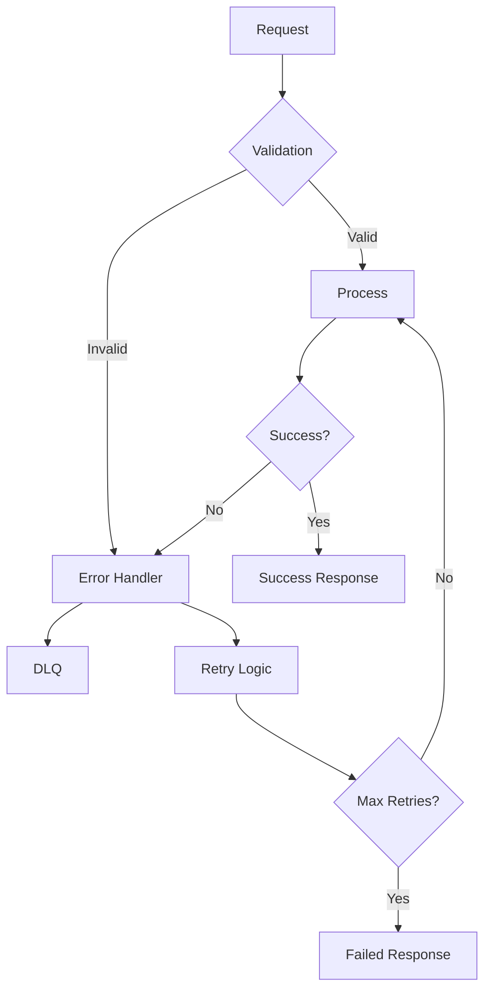
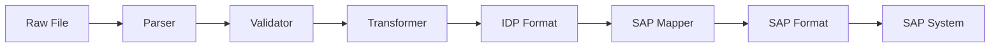
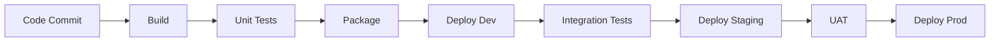

# Architecture Documentation

## 🏗️ System Architecture Overview

The Files to IDP to SAP integration follows a microservices-based architecture pattern using MuleSoft's Anypoint Platform, implementing the Application Lifecycle Connectivity (ALC) methodology for enterprise-grade integration.

## 🎯 Architecture Principles

### API-Led Connectivity
```
┌─────────────────┐
│ Experience APIs │  ← User interfaces, mobile apps
├─────────────────┤
│  Process APIs   │  ← Business processes, orchestration  
├─────────────────┤
│  System APIs    │  ← System of records (SAP, IDP)
└─────────────────┘
```

### Integration Patterns

#### 1. **File-to-System Pattern**


#### 2. **Error Handling Pattern**


## 🔧 Component Architecture

### Core Components

#### 1. **File Processing Engine**
- **File Listener**: Monitors input directories using polling strategy
- **Format Detection**: Automatic detection of CSV, XML, JSON formats
- **Parser Engine**: Format-specific parsing with error handling
- **Validation Layer**: Schema and business rule validation

#### 2. **IDP Integration Layer**
- **Authentication Manager**: OAuth 2.0 flow implementation
- **Token Manager**: Automatic token refresh and caching
- **API Client**: RESTful API communication with retry logic
- **Response Handler**: Response processing and error mapping

#### 3. **SAP Integration Layer**
- **SAP Connector**: RFC and BAPI connectivity
- **Function Mapper**: Business function mapping
- **Error Handler**: SAP-specific error processing
- **Transaction Manager**: Transactional integrity

#### 4. **Data Transformation Engine**
- **DataWeave Scripts**: Transformation logic
- **Schema Registry**: Data model definitions
- **Mapping Rules**: Business mapping configurations
- **Validation Rules**: Data quality checks

## 🌐 Network Architecture

### Deployment Topology
```
┌─────────────────────────────────────────────────────────────┐
│                    DMZ Network                              │
├─────────────────────────────────────────────────────────────┤
│  ┌─────────────┐    ┌─────────────┐    ┌─────────────┐     │
│  │    ALB      │    │   MuleSoft  │    │   API GW    │     │
│  │             │    │  Runtime    │    │             │     │
│  └─────────────┘    └─────────────┘    └─────────────┘     │
└─────────────────────────────────────────────────────────────┘
┌─────────────────────────────────────────────────────────────┐
│                  Private Network                            │
├─────────────────────────────────────────────────────────────┤
│  ┌─────────────┐    ┌─────────────┐    ┌─────────────┐     │
│  │     IDP     │    │   Database  │    │  SAP System │     │
│  │   System    │    │             │    │             │     │
│  └─────────────┘    └─────────────┘    └─────────────┘     │
└─────────────────────────────────────────────────────────────┘
```

### Security Zones

| Zone | Components | Security Level |
|------|------------|----------------|
| **DMZ** | Load Balancer, API Gateway | Public-facing |
| **Application** | MuleSoft Runtime | Internal |
| **Data** | IDP, SAP, Database | Restricted |

## 🔄 Data Flow Architecture

### End-to-End Data Flow
```
1. File Detection
   ├── Polling mechanism scans input directory
   ├── File metadata extraction
   └── Format identification

2. File Processing
   ├── Content reading and parsing
   ├── Schema validation
   ├── Business rule validation
   └── Data transformation

3. IDP Integration
   ├── OAuth authentication
   ├── API payload preparation
   ├── HTTP request execution
   └── Response processing

4. SAP Integration
   ├── Data mapping to SAP format
   ├── RFC/BAPI function calls
   ├── Transaction processing
   └── Confirmation handling

5. Post-Processing
   ├── File archival
   ├── Audit logging
   └── Notification sending
```

### Data Transformation Pipeline


## 🛡️ Security Architecture

### Authentication & Authorization
```
┌─────────────────┐
│   OAuth 2.0     │
│  Client Creds   │ ← IDP Authentication
├─────────────────┤
│   SAML/SSO      │ ← User Authentication
├─────────────────┤
│   API Keys      │ ← Service Authentication
└─────────────────┘
```

### Data Protection
- **Encryption in Transit**: TLS 1.3 for all communications
- **Encryption at Rest**: AES-256 for stored credentials
- **Data Masking**: PII protection in logs
- **Access Control**: Role-based permissions

## 📊 Scalability Architecture

### Horizontal Scaling
```
┌─────────────────┐
│   Load Balancer │
└─────────┬───────┘
          │
    ┌─────▼─────┬─────────────┬─────────────┐
    │ Runtime 1 │ Runtime 2   │ Runtime N   │
    └───────────┴─────────────┴─────────────┘
```

### Performance Characteristics

| Component | Throughput | Latency | Scalability |
|-----------|------------|---------|-------------|
| **File Processing** | 1000 files/min | <100ms | Horizontal |
| **IDP Integration** | 5000 TPS | <200ms | Vertical |
| **SAP Integration** | 500 TPS | <500ms | Connection Pool |

## 🔧 Technology Stack

### Runtime Environment
- **Mule Runtime**: 4.4.0 Enterprise Edition
- **Java**: OpenJDK 8/11
- **Memory**: 2GB heap minimum
- **CPU**: 2 vCPU minimum

### Dependencies
```xml
<dependencies>
    <!-- Core MuleSoft -->
    <dependency>
        <groupId>org.mule.connectors</groupId>
        <artifactId>mule-http-connector</artifactId>
    </dependency>
    
    <!-- File Processing -->
    <dependency>
        <groupId>org.mule.connectors</groupId>
        <artifactId>mule-file-connector</artifactId>
    </dependency>
    
    <!-- SAP Integration -->
    <dependency>
        <groupId>org.mule.connectors</groupId>
        <artifactId>mule-sap-connector</artifactId>
    </dependency>
    
    <!-- Testing -->
    <dependency>
        <groupId>com.mulesoft.munit</groupId>
        <artifactId>munit-runner</artifactId>
    </dependency>
</dependencies>
```

## 📈 Monitoring Architecture

### Observability Stack
```
┌─────────────────┐
│   Application   │
│     Metrics     │ ← Custom metrics
├─────────────────┤
│  Infrastructure │
│     Metrics     │ ← System metrics
├─────────────────┤
│      Logs       │ ← Application logs
├─────────────────┤
│     Traces      │ ← Request tracing
└─────────────────┘
```

### Key Metrics
- **Business Metrics**: Files processed, success rate, processing time
- **Technical Metrics**: CPU, memory, disk, network
- **Error Metrics**: Error rate, error types, retry counts

## 🔄 Deployment Architecture

### Environment Strategy
```
Development → Testing → Staging → Production
     ↓           ↓         ↓          ↓
  Local IDE   → UAT    → PreProd  → Prod
     ↓           ↓         ↓          ↓
  Unit Tests  → API    → Load     → Monitor
              Tests    Tests
```

### CI/CD Pipeline


## 🎯 Design Patterns

### Integration Patterns Used

1. **Message Router**: Route files based on type
2. **Message Translator**: Transform between formats
3. **Retry Pattern**: Handle transient failures
4. **Circuit Breaker**: Prevent cascade failures
5. **Scatter-Gather**: Parallel processing
6. **Correlation**: Track request flow

### Anti-Patterns Avoided

1. **Shared Database**: Each system owns its data
2. **Synchronous Communication**: Async where possible
3. **Tight Coupling**: Loose coupling via APIs
4. **No Error Handling**: Comprehensive error strategy

## 📋 Quality Attributes

### Non-Functional Requirements

> These are **design targets** for the reference pattern, not measured results from a production deployment.


| Attribute | Target | Measurement |
|-----------|--------|-------------|
| **Availability** | 99.9% | Uptime monitoring |
| **Performance** | <200ms | Response time |
| **Scalability** | 10x load | Load testing |
| **Security** | Zero breaches | Security audits |
| **Maintainability** | <4 hours MTTR | Incident response |

## 🔮 Future Architecture Considerations

### Roadmap Items
1. **Event-Driven Architecture**: Implement with Kafka
2. **Microservices**: Break into smaller services
3. **Container Orchestration**: Kubernetes deployment
4. **AI/ML Integration**: Intelligent file processing
5. **Real-time Analytics**: Stream processing capabilities

---

This architecture documentation provides a comprehensive view of the system design, ensuring maintainability, scalability, and reliability for enterprise integration requirements.